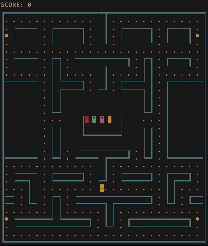

# pacman
pacman on your terminal!

## Note
I'm still in the process of learning C++. The intent of this project is for me to pick up the language and hence the code quality is doomed to suck.

Also, the implementation is pretty incomplete.

## TODOs
- [ ] Add all 4 ghosts.
- [ ] Implement unqiue AI for the ghosts.
- [ ] Add a ghost cage where the ghosts would start from.
- [ ] Implement power pellet logic.
- [ ] Implement wrap-up tunnels on the sides of the game maze.
- [ ] Implement levels.
- [ ] Implement multiple life-s.
- [ ] Clean-up the UI.
  - [ ] Add a top box to display score.
  - [ ] Add a bottom box to display life and level.
  - [ ] Implement a help window.
  - [ ] Implement a proper game over pop-up.

## Building

- [ ] TODO: Add a makefile.

```sh
$ g++ -std=c++17 -lncurses src/pacman/view.cc src/pacman/game.cc src/pacman/hero.cc src/pacman/cell.cc src/pacman/ghost.cc src/main.cc -o bin/pacman.out
```
